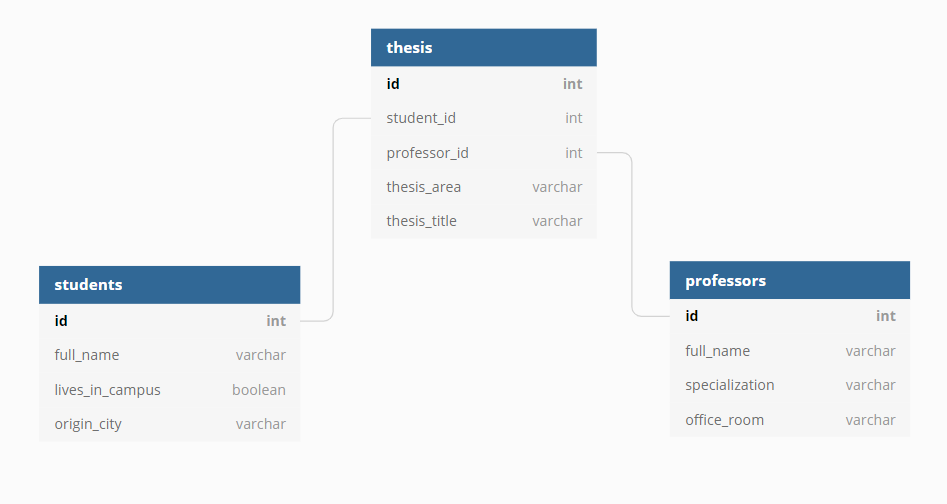

# Databases-Comparison
A time/memory comparison between PostgreSQL, MySQL and Oracle DB

The list of names used in this project were generated through online tools for random generation processes.

The purpose of this project is to analyze how PostgreSQL, MySQL and Oracle DB perform on standard operations (insertion, deletion, updates etc) on a small database.

The simple database structure used in the project is the following:

